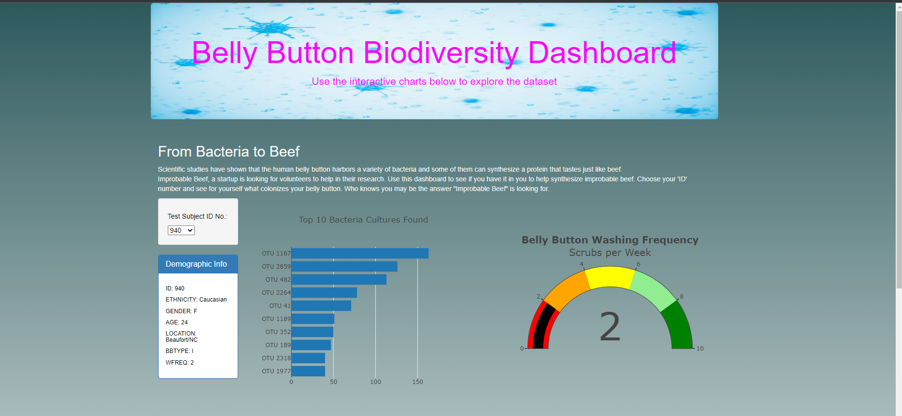
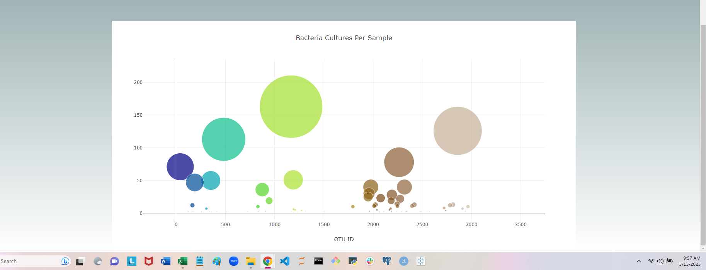

# Belly_Button_Biodiversity

## Overview of the Project

The purpose of this project is to create interactive charts based on the Test Subject ID selected. When the page is first loaded the demographic information and charts for the first Test Subject ID '940' is displayed. A dropdown menu is provided for the user to select any Test Subject ID and the charts and demographic information will be refreshed based on the selected 'ID'. 

There are three charts :-

1.  A Bar Chart showing the top 10 bacteria cultures found in the test subject's belly button

2.  A Gauge Chart that shows the Belly Button washing frequency

3.  A Bubble Chart that shows all the different bacterial cultures for the test subject. The size of the bubble depends on the count of the bacteria.

